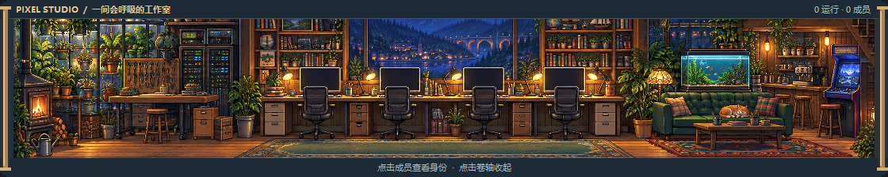

# PixelStudio · 像素工作室

Windows 桌面悬浮小组件：用一座会动的**像素工作室**呈现 AI 团队的可见状态，同时监控 **Codex** 与 **Kimi Code** 额度。



## 分支说明

| 分支 | 内容 |
| --- | --- |
| `gpt` | 原始版：Codex 额度 + 任务/子代理文本列表 |
| `kimi` | 像素办公室增强版，保留历史开发分支 |
| `main` | 基于 `kimi` 的当前维护版：以下全部功能与状态准确性修正 |

## main 分支功能

- **双额度卡片**：Codex 短/长周期剩余额度与重置时间；Kimi Code 剩余/总额度、会员等级、已用量与重置时间，进度条低于 20% 变橙
- **边缘吸附**：拖动时自动吸附屏幕四边（左右留 16px、底部避开任务栏）与水平中线
- **分辨率跟随**：记录吸附边与相对比例，分辨率变化时吸附边保持贴边、其余轴按比例换算；折叠/展开后保持底边吸附
- **像素世界画卷**：点击 AI 团队画面或“展开画卷”，在原位用约 0.42 秒的动画拉开横向画卷；只有画面从 294px 展到最多 1120px，额度与任务栏始终保持 320px。画卷高度固定为 224px，展开时不挤动上下卡片，也不创建独立窗口；靠近屏幕边缘时自动向可用空间展开
- **生成式像素场景**：使用内置 GPT Image 制作全景底图，包含温室、服务器控制角、协作工位、咖啡休息区、鱼缸、街机与猫。程序叠加屏幕代码、咖啡蒸汽与细小光点；背景以整数最近邻采样，窗口只裁切，不随展开拉伸
- **真实团队状态**：子代理按可见状态走位，运行中去工位、空闲去休息区、异常去检修区；未加载与未知状态保留问号。点击展开后的成员可查看身份；场景最多绘制 12 位成员，顶部保留完整总数。没有成员时只展示场景，不生成虚构人员
- **像素美少女成员**：银紫短发／薄荷开衫与栗色马尾／杏色开衫两套造型，画卷与成员卡共用同一精灵图。场景人物约 64px 高，列表头像约 38px 高；会话内按成员身份分配，刷新、排序或状态变化不会换造型
- **待机动画**：四帧精灵配合轻微呼吸、重心摆动，约每 4.2–6 秒眨眼；每位成员的动作错开节奏。待机动画只表现角色外观，未加载成员仍显示“状态未知”，不会因动作被计为运行中
- **团队小记**：按本地日期累积当天活跃过的任务数、上岗成员峰值与忙碌时长，展示昨日小记 / 今日进展
- **马维斯风格成员卡**：任务与子代理统一为圆角卡片（像素动画 + 名称 + 口语化状态 + 角色/归属/活跃时间）
- **圆角窗口与场景**：Windows 桌面外轮廓采用透明圆角；办公室每帧将动画裁到圆角房间内
- 窗口置顶、双击折叠、20 秒自动刷新、位置与状态持久化

### 画卷操作

- 点击收起状态的画面或“展开画卷”展开；点击两侧卷轴、“收起画卷”，或在组件获得焦点时按 `Esc` 收起。
- 动画中再次点击可反向收放；展开后数据仍按原来的 20 秒间隔更新。
- 拖动标题栏移动整个组件。保存的是窄栏位置，重新启动时画卷默认收起。
- 顶栏“收起”仍用于折叠整个详情区，也会收回画卷；两种折叠互不混淆。

## 数据来源

- **Codex**：通过本地 `codex app-server --stdio` 协议查询（`account/rateLimits/read`、`thread/list`），不读取任何认证文件；可用环境变量 `CODEX_CLI_PATH` 指定 CLI 路径
- **Kimi Code**：读取 kimi-code `config.toml` 中的 `api_key` / `base_url`，请求 `GET {base_url}/usages`；可用环境变量 `KIMI_CODE_CONFIG` 指定配置文件路径

Codex 桌面应用进程中的任务在独立 app-server 里可能显示为 `notLoaded`。组件会标为“未加载”或“状态未知”，不将它解释为已结束或休息。

## 运行

要求：Windows + Python 3.10+（仅标准库，无第三方依赖）

```powershell
# 直接运行（无控制台窗口）
pythonw widget.py

# 或创建桌面快捷方式
powershell -ExecutionPolicy Bypass -File install_shortcut.ps1
```

窗口位置、置顶、折叠状态保存在上级目录 `.runtime/widget-preferences.json`；团队统计保存在 `.runtime/widget-team-stats.json`（保留最近 7 天）。

## 素材署名

当前全景底图为本项目通过 Codex 内置 imagegen 生成的素材，保存在 `assets/pixel-world.png`，实际请求型号为 `gpt-image-2`；[完整提示词与尺寸](assets/pixel-world.prompt.txt)随仓库保存。`pixel_world.py` 加载仓库内 PNG，以整数最近邻采样并裁切中央横带；实时角色和动画由 Tkinter 绘制，无额外运行依赖。素材缺失或无法读取时退回简易程序像素场景。

角色精灵图为内置 imagegen 生成的透明 PNG：`assets/characters-idle.png`；[提示词](assets/characters-idle.prompt.txt)与[帧坐标](assets/characters-idle.json)随仓库保存。`character_sprites.py` 统一加载、切帧和分配造型，并使用现有动画心跳；素材不可用时回退为简易人形像素轮廓。运行时仍只依赖 Python 标准库。

仓库保留的早期办公室电脑、饮水机像素动画来自 OpenGameArt 的
[Office worker sprites](https://opengameart.org/content/office-worker-sprites)，
作者 **emcee-flesher**，许可证 **CC-BY 4.0**。详见 [assets/ATTRIBUTION.md](assets/ATTRIBUTION.md)。
这些历史素材不再参与当前画卷渲染，署名与许可证继续保留。
