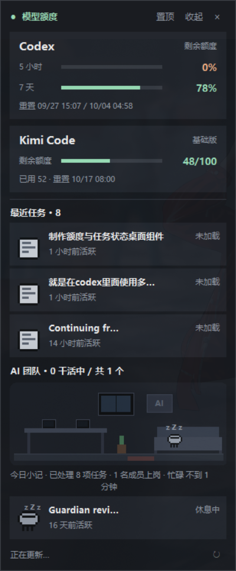

# PixelStudio · 像素工作室

Windows 桌面悬浮小组件：把你的 AI 子代理变成一座会动的**像素工作室**——谁在打字、谁在摸鱼、谁卡 Bug，一目了然；同时监控 **Codex** 与 **Kimi Code** 额度。



## 分支说明

| 分支 | 内容 |
| --- | --- |
| `gpt` | 原始版：Codex 额度 + 任务/子代理文本列表 |
| `kimi` | 增强版（推荐）：以下全部功能 |

## kimi 分支功能

- **双额度卡片**：Codex 短/长周期剩余额度与重置时间；Kimi Code 剩余/总额度、会员等级、已用量与重置时间，进度条低于 20% 变橙
- **边缘吸附**：拖动时自动吸附屏幕四边（左右留 16px、底部避开任务栏）与水平中线
- **分辨率跟随**：记录吸附边与相对比例，分辨率变化时吸附边保持贴边、其余轴按比例换算；折叠/展开后保持底边吸附
- **像素办公室**（致敬 [Star-Office-UI](https://github.com/ringhyacinth/Star-Office-UI)）：子代理按状态自动走位——干活中去工位打字（显示器点亮）、待命/休息上沙发（眨眼 / 飘 Zzz）、异常去 Bug 区面壁闪 `!`；新成员从门口走入，工位满了在绿植旁排队
- **团队小记**：按日累积任务数、上岗成员峰值与忙碌时长，展示昨日小记 / 今日进展
- **马维斯风格成员卡**：任务与子代理统一为圆角卡片（像素动画 + 名称 + 口语化状态 + 角色/归属/活跃时间）
- 圆角 UI、窗口置顶、双击折叠、20 秒自动刷新、位置与状态持久化

## 数据来源

- **Codex**：通过本地 `codex app-server --stdio` 协议查询（`account/rateLimits/read`、`thread/list`），不读取任何认证文件；可用环境变量 `CODEX_CLI_PATH` 指定 CLI 路径
- **Kimi Code**：读取 kimi-code `config.toml` 中的 `api_key` / `base_url`，请求 `GET {base_url}/usages`；可用环境变量 `KIMI_CODE_CONFIG` 指定配置文件路径

## 运行

要求：Windows + Python 3.10+（仅标准库，无第三方依赖）

```powershell
# 直接运行（无控制台窗口）
pythonw widget.py

# 或创建桌面快捷方式
powershell -ExecutionPolicy Bypass -File install_shortcut.ps1
```

窗口位置、置顶、折叠状态保存在上级目录 `.runtime/widget-preferences.json`；团队统计保存在 `.runtime/widget-team-stats.json`（保留最近 7 天）。

## 素材署名

办公室场景中的电脑、饮水机像素动画来自 OpenGameArt 的
[Office worker sprites](https://opengameart.org/content/office-worker-sprites)，
作者 **emcee-flesher**，许可证 **CC-BY 4.0**。详见 [assets/ATTRIBUTION.md](assets/ATTRIBUTION.md)。
房间家具与角色均为程序手绘，素材缺失时电脑与饮水机会退回手绘图形，不影响使用。
