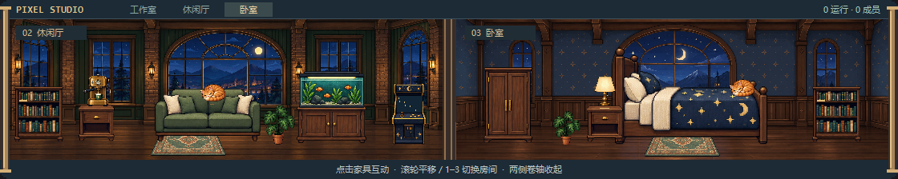

# PixelStudio · 像素工作室

Windows 桌面悬浮小组件：用一座会动的**像素工作室**呈现 AI 团队的可见状态，同时监控 **Codex** 与 **Kimi Code** 额度。



## 分支说明

| 分支 | 内容 |
| --- | --- |
| `gpt` | 原始版：Codex 额度 + 任务/子代理文本列表 |
| `kimi` | 像素办公室增强版，保留历史开发分支 |
| `main` | 基于 `kimi` 的当前维护版：以下全部功能与状态准确性修正 |

## main 分支功能

- **双额度卡片**：Codex 短/长周期剩余额度与重置时间；Kimi Code 剩余/总额度、会员等级、已用量与重置时间，进度条低于 20% 变橙
- **边缘吸附**：拖动时自动吸附屏幕四边（左右留 16px、底部避开任务栏）与水平中线
- **分辨率跟随**：记录吸附边与相对比例，分辨率变化时吸附边保持贴边、其余轴按比例换算；折叠/展开后保持底边吸附
- **像素世界画卷**：点击 AI 团队画面或“展开画卷”，在原位用约 0.42 秒的动画拉开横向画卷；只有画面从 294px 展到最多 1120px，额度与任务栏始终保持 320px。画卷高度固定为 224px，展开时不挤动上下卡片，也不创建独立窗口；靠近屏幕边缘时自动向可用空间展开
- **三个独立房间**：工作室、休闲厅与卧室各宽 560px，横向地图总宽 1680px；通过房间按钮、数字键或滚轮浏览。每个房间由建筑背景与独立家具组成，使用内置 imagegen 生成素材，以整数最近邻采样并裁切，不随展开拉伸
- **家具互动**：电脑切换终端与屏保，衣柜开关、台灯和街机开关；咖啡机、绿植、鱼缸、沙发、猫和床各有短暂互动效果。家具各自拥有图层、状态与透明像素命中区域；书桌、座椅和地毯可查看说明。床的晚安效果只改变场景外观
- **真实团队状态**：运行中成员进入工作室，待命成员进入休闲厅；异常、未加载与未知状态留在工作室并显示相应标记。点击展开后的成员可查看身份；场景最多绘制 12 位真实成员，宽视口顶部显示完整总数。没有成员时只展示场景，不生成虚构人员；任何家具互动都不会改变 AI 运行状态
- **像素美少女成员**：银紫短发／薄荷开衫与栗色马尾／杏色开衫两套造型，画卷与成员卡共用同一精灵图。场景人物约 64px 高，列表头像约 38px 高；会话内按成员身份分配，刷新、排序或状态变化不会换造型
- **待机动画**：四帧精灵配合轻微呼吸、重心摆动，约每 4.2–6 秒眨眼；每位成员的动作错开节奏。待机动画只表现角色外观，未加载成员仍显示“状态未知”，不会因动作被计为运行中
- **团队小记**：按本地日期累积当天活跃过的任务数、上岗成员峰值与忙碌时长，展示昨日小记 / 今日进展
- **马维斯风格成员卡**：任务与子代理统一为圆角卡片（像素动画 + 名称 + 口语化状态 + 角色/归属/活跃时间）
- **圆角窗口与场景**：Windows 桌面外轮廓采用透明圆角；画卷使用圆角边缘遮罩收边
- 窗口置顶、双击折叠、20 秒自动刷新、位置与状态持久化

### 画卷操作

- 点击收起状态的画面或“展开画卷”展开；点击两侧卷轴、“收起画卷”，或在组件获得焦点时按 `Esc` 收起。
- 动画中再次点击可反向收放；展开后数据仍按原来的 20 秒间隔更新。
- 展开后点击顶部“工作室 / 休闲厅 / 卧室”切换房间。画面获得焦点时，按 `1` / `2` / `3` 直达房间，按 `←` / `→` 循环切换；鼠标滚轮横向平移地图。
- 悬停家具查看名称和状态，点击互动；选中家具后可按 `Enter` 再次互动。透明区域不会挡住后面的家具，成员选中优先于家具。
- 拖动标题栏移动整个组件。保存的是窄栏位置，重新启动时画卷默认收起。
- 顶栏“收起”仍用于折叠整个详情区，也会收回画卷；两种折叠互不混淆。

## 数据来源

- **Codex**：通过本地 `codex app-server --stdio` 协议查询（`account/rateLimits/read`、`thread/list`），不读取任何认证文件；可用环境变量 `CODEX_CLI_PATH` 指定 CLI 路径
- **Kimi Code**：读取 kimi-code `config.toml` 中的 `api_key` / `base_url`，请求 `GET {base_url}/usages`；可用环境变量 `KIMI_CODE_CONFIG` 指定配置文件路径

Codex 桌面应用进程中的任务在独立 app-server 里可能显示为 `notLoaded`。组件会标为“未加载”或“状态未知”，不将它解释为已结束或休息。

## 运行

要求：Windows + Python 3.10+（仅标准库，无第三方依赖）

```powershell
# 直接运行（无控制台窗口）
pythonw widget.py

# 或创建桌面快捷方式
powershell -ExecutionPolicy Bypass -File install_shortcut.ps1
```

以下文件均保存在项目上级目录的 `.runtime/`：窗口位置、置顶、折叠状态使用 `widget-preferences.json`；团队统计使用 `widget-team-stats.json`（保留最近 7 天）；家具独立使用 `widget-world-state.json`。开关和循环状态会保存，冲咖啡、浇水、晚安等短暂效果到期复位且不写入存档。

房间配置、物品字段和扩展方法见[文档索引](docs/00-索引.md)与[房间与物品](docs/01-房间与物品.md)。

## 素材署名

当前房间素材通过 Codex 内置 imagegen 新生成，位于 `assets/rooms/`：三个 `*-shell.png` 提供墙面、窗户、地板及固定建筑装饰，工作室和休闲厅背景还包含固定墙灯；`furniture-atlas.png` 提供 16 种独立家具与猫的透明精灵。原始 PNG、生成提示词和图集裁切坐标均随仓库保留。`scene_assets.py` 在运行时切帧、整数采样与裁切，`scene_objects.py` 单独绘制互动效果；无需额外运行依赖。背景无法读取时显示简易墙面地板，家具素材不可用时显示带名称的占位块。

早期整张全景 `assets/pixel-world.png`、其[提示词](assets/pixel-world.prompt.txt)与 `docs/pixel-world.png` 预览作为历史素材保留，当前房间渲染不再加载它们。

角色精灵图为内置 imagegen 生成的透明 PNG：`assets/characters-idle.png`；[提示词](assets/characters-idle.prompt.txt)与[帧坐标](assets/characters-idle.json)随仓库保存。`character_sprites.py` 统一加载、切帧和分配造型，并使用现有动画心跳；素材不可用时回退为简易人形像素轮廓。运行时仍只依赖 Python 标准库。

仓库保留的早期办公室电脑、饮水机像素动画来自 OpenGameArt 的
[Office worker sprites](https://opengameart.org/content/office-worker-sprites)，
作者 **emcee-flesher**，许可证 **CC-BY 4.0**。详见 [assets/ATTRIBUTION.md](assets/ATTRIBUTION.md)。
这些历史素材不再参与当前画卷渲染，署名与许可证继续保留。
