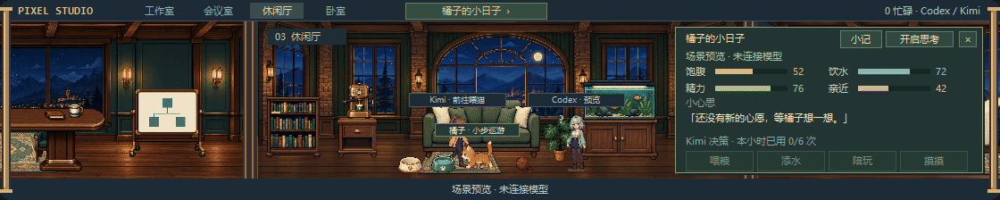

# PixelStudio · 像素工作室

Windows 桌面悬浮小组件：一座有工作、交流、休憩与照护活动的**像素工作室**。以整体环境为中心，伙伴、小猫和物品各自参与日常，同时监控 **Codex** 与 **Kimi Code** 额度。


## 分支说明

| 分支 | 内容 |
| --- | --- |
| `gpt` | 原始版：Codex 额度 + 任务/子代理文本列表 |
| `kimi` | 像素办公室增强版，保留历史开发分支 |
| `main` | 基于 `kimi` 的当前维护版：以下全部功能与状态准确性修正 |

## main 分支功能

- **双额度卡片**：Codex 短/长周期剩余额度与重置时间；Kimi Code 剩余/总额度、会员等级、已用量与重置时间，进度条低于 20% 变橙
- **更紧凑的日常界面**：直接展示额度、像素工作室、团队小记与两张当前状态卡；移除历史任务记录区。读取失败或超过 60 秒未更新时清除旧额度显示，提示自动重试。
- **边缘吸附**：拖动时自动吸附屏幕四边（左右留 16px、底部避开任务栏）与水平中线
- **分辨率跟随**：记录吸附边与相对比例，分辨率变化时吸附边保持贴边、其余轴按比例换算；折叠/展开后保持底边吸附
- **像素世界画卷**：点击 AI 团队画面或“展开画卷”，在原位用约 0.42 秒的动画拉开横向画卷；只有画面从 294px 展到最多 1120px，额度与状态栏始终保持 320px。画卷高度固定为 224px，展开时不挤动上下卡片，也不创建独立窗口；靠近屏幕边缘时自动向可用空间展开
- **环境优先**：工作室标题与房间导航保留；没有寻找特定成员的按钮或快捷键。伙伴与小猫默认不显示姓名牌，点击后才查看详情。宽画卷顶栏显示本地时段和时间；这些是环境提示，建筑素材本身没有自动昼夜换色。
- **四个独立房间**：工作室、会议室、休闲厅与卧室各宽 560px，横向地图总宽 2240px；通过房间按钮、数字键或滚轮浏览。每个房间由建筑背景与独立家具组成，使用内置 imagegen 生成素材，以整数最近邻采样并裁切，不随展开拉伸
- **家具互动**：电脑切换终端与屏保，衣柜开关、台灯和街机开关；咖啡机、绿植、鱼缸、沙发和床各有短暂互动效果。家具各自拥有图层、状态与透明像素命中区域；书桌、座椅和地毯可查看说明。床的晚安效果只改变场景外观
- **小猫橘子**：场景只有一只会步行、进食、玩耍和睡觉的橘猫；休闲厅的粮碗、水碗、毛线球和卧室猫窝均为独立物品。饱腹、饮水、精力、亲近值持续保存，离线最多温和补算 30 分钟，没有死亡或惩罚机制
- **真实模型照护**：`k3-256k` 通过本机网关生成小猫心愿，选择行动和照护伙伴。Codex 或 Kimi 走到位并完成动作后才更新数值和照护记录；总结会议优先，过期安排丢弃。可随时暂停思考，连接失败会显示错误，不用规则冒充模型决定
- **Codex / Kimi 常驻伙伴**：两位角色拥有固定身份；Codex 展示本机最近活动的主任务、执行状态和模型，Kimi 展示网关中真实的 Kimi 模型调用、接收阶段、耗时与最近传输结果。约每 2 秒读取一次，历史子代理不再决定角色数量。角色常驻不表示有两个子代理正在运行
- **自动总结会**：Codex 进入最终答复阶段，或观察到本轮任务刚结束时，两位伙伴步行到会议室、入座交流；结束信号后保留约 35 秒再起身返回。会议完全由真实状态触发，白板与长桌可查看说明；下方卡片继续展示真实状态
- **像素美少女造型**：Codex 固定银紫短发／薄荷开衫，Kimi 固定栗色马尾／杏色开衫；画卷与伙伴卡共用精灵图。场景人物以原版的 1.25 倍显示（高度上限约 80px），列表头像约 38px 高，刷新和状态变化不会换造型
- **待机动画**：四帧精灵配合轻微呼吸、重心摆动，约每 4.2–6 秒眨眼；两位伙伴的动作错开节奏。待机动画只表现角色外观，数据不可用时仍显示“状态未知”，不会因动作被计为运行中
- **连续动作**：独立步行动作帧、随移动方向转身、坐下与起立过渡；开会时面对彼此，交替发言、抬手与点头，白板逐步出现示意笔迹、杯口飘出蒸汽。空闲时在活动区小范围散步，点击伙伴会回应。画卷约 33ms 推进与合并绘制，家具保留原来的动画节奏；房间切换使用平滑镜头
- **合并渲染**：提前准备透明窗口与固定画布，使用遮罩展开画卷，窄栏保持屏幕位置；收放与场景共用动画时钟。人物、物品效果和界面图元复用，尺寸与输入变化合并到一次绘制，避免每帧重建图元及反复缩放整个窗口。
- **团队小记**：按本地日期累积当天活跃过的任务数、上岗成员峰值与忙碌时长，展示昨日小记 / 今日进展
- **圆角伙伴卡**：固定展示 Codex 与 Kimi 的像素头像、名称、实时状态及任务或调用详情；当前任务与模型调用详情直接在这两张卡片查看
- **圆角窗口与场景**：Windows 桌面外轮廓采用透明圆角；画卷使用圆角边缘遮罩收边
- 窗口置顶、双击折叠、20 秒自动刷新、位置与状态持久化

### 画卷操作



上图为离线动作预览；真实小猫的心愿和行动由运行中的 Kimi 请求决定。

- 点击收起状态的画面或“展开画卷”展开；点击两侧卷轴、“收起画卷”，或在组件获得焦点时按 `Esc` 收起；橘子面板打开时，`Esc` 先关闭面板。
- 动画中再次点击可反向收放；额度与后台线程快照每 20 秒更新，伙伴状态约每 2 秒更新。
- 展开后点击顶部“工作室 / 会议室 / 休闲厅 / 卧室”切换房间。画面获得焦点时，按 `1` / `2` / `3` / `4` 直达房间，按 `←` / `→` 循环切换；鼠标滚轮横向平移地图。
- 悬停家具查看名称和状态，点击互动；选中家具后可按 `Enter` 再次互动。透明区域不会挡住后方对象；小猫面板与宠物物品优先接收点击，其后按过道角色、前景家具、入座角色、后景家具的顺序选中可见对象。
- 点击场景里的橘子或它的独立物品打开小面板。面板显示需求值、真实模型心愿、照护进度和本小时调用次数；“小记”分页展示最近 6 条记录，每页 3 条并标注时间。
- “喂粮 / 添水 / 陪玩 / 摸摸”向模型提出照护意图，仍需等待模型安排与伙伴完成动作。“暂停思考”撤销未完成照护，使在途结果作废；已有需求与调用限额继续保存。
- 拖动标题栏移动整个组件。保存的是窄栏位置，重新启动时画卷默认收起。
- 顶栏“收起”仍用于折叠整个详情区，也会收回画卷；两种折叠互不混淆。

## 数据来源

- **Codex 额度与后台线程快照**：通过本地 `codex app-server --stdio` 协议查询（`account/rateLimits/read`、`thread/list`），不读取任何认证文件；可用环境变量 `CODEX_CLI_PATH` 指定 CLI 路径
- **Codex 伙伴任务**：只读本地 `state_N.sqlite` 和 `thread_history_N.sqlite` 的最新轮次状态、名称、模型和最终答复阶段元数据。排除子代理，不读取消息或工具正文；源不兼容则回退线程列表，未加载保留未知
- **Kimi Code**：读取 kimi-code `config.toml` 中的 `api_key` / `base_url`，请求 `GET {base_url}/usages`；可用环境变量 `KIMI_CODE_CONFIG` 指定配置文件路径
- **Kimi 伙伴调用**：读取本机网关 `http://127.0.0.1:15723/activity`；可用 `PIXELSTUDIO_GATEWAY_URL` 指定回环根地址。旧网关没有接口时显示未接入。调用状态与额度、任务是否结束互相独立
- **橘子的模型决定**：通过同一回环网关的 `/v1/responses` 调用真实 `k3-256k`。宠物客户端不发认证头、不使用环境代理并拒绝重定向；仅发送猫名、四项需求、需求提示、照护意图、两个伙伴的 ID 与状态、会议状态和上次动作，不发送聊天内容或真实任务标题。两次请求至少间隔 60 秒，滑动一小时最多 6 次，每次没有内部重试；失败尝试也计入限额

Codex 桌面应用进程中的任务在独立 app-server 里可能显示为 `notLoaded`。组件会标为“未加载”或“状态未知”，不将它解释为已结束或休息。

## 运行

要求：Windows + Python 3.10+（仅标准库，无第三方依赖）

```powershell
# 直接运行（无控制台窗口）
pythonw widget.py

# 或创建桌面快捷方式
powershell -ExecutionPolicy Bypass -File install_shortcut.ps1
```

Windows 桌面入口按存档目录使用单实例互斥量：在同一 Windows 登录会话中重复启动同一组件时，后来启动的实例立即退出，避免多个窗口并行写存档或各自计算模型调用次数。

以下文件均保存在项目上级目录的 `.runtime/`：

| 文件 | 内容 |
| --- | --- |
| `widget-preferences.json` | 窗口位置、置顶及详情折叠状态 |
| `widget-team-stats.json` | 团队统计，保留最近 7 天 |
| `widget-world-state.json` | 家具开关与循环状态；冲咖啡、浇水、晚安等短暂效果不存档 |
| `widget-pet-state.json` | 橘子四项需求、最近 6 条照护记录与时间，格式版本 1 |
| `widget-pet-brain.json` | 模型开关、调用次数与最近真实决定，格式版本 1；调用前先保存限额 |

重启会恢复宠物需求、模型开关和有效调用限额，但不重新执行旧决定。`PixelWorld` 默认 `pet_live=False`，可用内存状态做无模型请求、无宠物存档读写的场景预览；桌面 `widget.py` 显式启用真实模式。模型网关不可用时显示错误，房间仍可浏览。

房间配置、物品字段和扩展方法见[文档索引](docs/00-索引.md)、[房间与物品](docs/01-房间与物品.md)、[常驻伙伴与总结会议](docs/02-常驻伙伴与总结会议.md)及[小猫与模型照护](docs/03-小猫与模型照护.md)。

## 素材署名

当前房间素材通过 Codex 内置 imagegen 生成，位于 `assets/rooms/`：四个 `*-shell.png` 提供建筑背景；`furniture-atlas.png` 提供 16 种家具与猫，`meeting-furniture.png` 独立提供会议桌、白板和会议椅。原始 PNG、提示词和裁切坐标均随仓库保留。`scene_assets.py` 在运行时切帧、整数采样与裁切，`scene_objects.py` 单独绘制互动效果；无需额外运行依赖。素材不可用时保留简易图形回退。

橘子使用独立的 `assets/cat-actions.png`，共 12 帧：坐姿、眨眼、四帧步行，以及各两帧进食、睡觉和玩耍。`assets/rooms/cat-care.png` 提供满/空粮碗、满/空水碗、猫窝和毛线球。两张图均由内置 imagegen 参考原家具图集生成，保留 2172×724 透明原图、提示词与裁切矩形；Tk 仅在运行时裁切、整数采样和镜像。原家具图集中的猫继续保留作兼容素材，休闲厅和卧室不再摆放静态猫。

早期整张全景 `assets/pixel-world.png`、其[提示词](assets/pixel-world.prompt.txt)与 `docs/pixel-world.png` 预览作为历史素材保留，当前房间渲染不再加载它们。

角色精灵图为内置 imagegen 生成的透明 PNG：`assets/characters-idle.png`；[提示词](assets/characters-idle.prompt.txt)与[帧坐标](assets/characters-idle.json)随仓库保存。`character_sprites.py` 统一加载、切帧和分配造型，并使用现有动画心跳；素材不可用时回退为简易人形像素轮廓。运行时仍只依赖 Python 标准库。

动作图集 `assets/characters-motion.png` 以原角色为参考，由修复后的原生生图编辑入口生成，包含每位角色四帧步行、两帧坐姿、两帧发言；原图、`.prompt.txt` 与 `.json` 坐标均保留。动画中的发言顺序、白板笔迹属于场景表现，不表示读取了真实模型输出或 Kimi 正在调用。

仓库保留的早期办公室电脑、饮水机像素动画来自 OpenGameArt 的
[Office worker sprites](https://opengameart.org/content/office-worker-sprites)，
作者 **emcee-flesher**，许可证 **CC-BY 4.0**。详见 [assets/ATTRIBUTION.md](assets/ATTRIBUTION.md)。
这些历史素材不再参与当前画卷渲染，署名与许可证继续保留。
