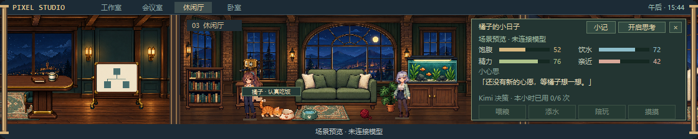

# 小猫与模型照护

最后更新：2026-10-04

橘子是工作室里唯一的小猫。真实 Kimi 模型决定它下一步想做什么、由哪位伙伴照顾，并生成中文“小心思”；本地程序负责需求数值、步行、动画、照护完成条件与存档。原休闲厅和卧室中的静态猫已移除，旧素材键 `cat` 仅保留兼容。

## 日常操作

- 展开画卷后点击橘子或独立照护物品打开“橘子的小日子”。工作室不提供小猫专属的寻找按钮或快捷键。
- 面板展示饱腹、饮水、精力、亲近值，模型返回的最近心愿、调用状态、剩余次数与最近照护记录。点击“小记”分页翻阅最近 6 条记录，每页 3 条并显示相对时间；“近况”返回需求与心愿视图。旧心愿标为“上次的小心思”并显示时间。
- 伙伴的生活模型也可主动提出照护；面板显示哪位伙伴想照顾橘子，原猫咪心愿仍标为“上次的小心思”，不把伙伴决定当作橘子自己的新模型心愿。小猫与伙伴人物面板互斥，`Esc` 优先关闭当前面板。
- “喂粮 / 添水 / 陪玩 / 摸摸”按钮向模型提出意图；点击粮碗、水碗、毛线球提出相应意图。模型结合当前需求作出安排，点击本身不增加数值或产生已完成记录。猫窝点击只打开面板。
- “暂停思考”停止新决定，清除未完成照护并使在途请求结果作废；已经发送的 HTTP 请求可能仍会结束，但其返回不会应用。需求数值和存档继续保留，时间变化仍会推进。“开启思考”恢复调度，保留已有调用限额。
- 尚无真实模型结果时显示等待文案；连接失败、超时或答复无效时显示错误，不用本地规则生成冒充模型的心愿或决定。

## 需求与照护

四项需求均限制在 0–100。清醒时随时间缓慢下降，睡觉恢复精力，玩耍额外消耗精力。没有死亡或惩罚机制。运行中的单次时间间隔最多折算 120 秒；重启后的离线变化最多补算 30 分钟，离线时精力缓慢恢复。

`PetState.need()` 依次检查饱腹低于 55、饮水低于 50、精力低于 35、亲近低于 50，返回 `feed` / `water` / `sleep` / `play` 提示；没有明显需求时返回空值。这是发送给模型的本地状态摘要，实际行动仍需模型返回决定。

| 模型 action | 本地执行 |
| --- | --- |
| `feed` | 橘子与照护者走到休闲厅粮碗附近，喂粮并播放进食动作 |
| `water` | 走到休闲厅水碗附近，添水并播放饮水动作 |
| `play` | 走到休闲厅毛线球附近，照护者陪玩 |
| `pet` | 照护者走到橘子当前位置，伸手摸摸 |
| `sleep` | 橘子自行走到卧室独立猫窝打盹 |
| `explore` | 橘子在模型指定的工作室、休闲厅或卧室小范围巡游 |
| `wait` | 橘子原地等待 |

模型只给行动意图与目标房间，具体坐标和步行路径由本地程序决定。橘子约以 78px/s 连续步行，伙伴沿已有过道路线到位。`feed` / `water` / `pet` 在双方到位后持续约 3.5 秒，`play` 持续约 5 秒，再调用 `PetState.apply_care()`；成功后才更新数值、写照护记录并保存，伙伴随后返回最新真实状态对应的位置。

喂粮增加 42 饱腹、5 亲近，添水增加 45 饮水、2 亲近，陪玩增加 18 亲近并消耗 4 精力，摸摸增加 5 亲近。喂粮、添水和陪玩冷却 60 秒，摸摸冷却 8 秒；饱腹或饮水已经达到 92 时拒绝重复补充，精力低于 20 时拒绝陪玩。被拒绝的照护不会生成成功记录。

总结会议优先。会议期间暂停伙伴照护路线，也不启动新模型请求；尚未过期的安排在散会后重新排队，到位后重新计时。未完成照护从模型决定被接纳起最多保留 180 秒，会议期间过期也会丢弃。照护关系丢失时同样重新排队，折叠详情等原因造成的长心跳间隔不会直接算作完成了照护动作。暂停思考则直接撤销安排。伙伴照护只控制场景动作，不修改真实任务状态。

## 伙伴主动照护

两位伙伴的联合生活模型可以选择 `care_cat`，照护动作仍仅限 `feed` / `water` / `play` / `pet`。`PetLayer.offer_care(caregiver, action, model=..., decided_at=...)` 仅在真实模式、伙伴明确空闲、未开会、小猫思考启用且不忙碌、没有用户照护意图与已有照护时接纳；两人不能同时提出照护。具体生活决定格式见 [05-伙伴人格与日常](05-伙伴人格与日常.md)。

接纳的临时计划带 `source=companion-model`、模型名和时间戳，由原 `PetLayer` 的到位、连续计时、冷却与完成条件执行。它不会覆盖 `PetBrain.last_decision` 或生成新的猫咪心愿，照护数值和小猫记录仍只由成功的 `PetState.apply_care()` 更新。`SoulLayer` 观察到新的实际照护记录后，再给照护者保存生活小记与完成计数；重启不会重复记录旧照护。

人物面板的“暂停日常”只撤销 `companion-model` 来源的未完成照护，小猫自己的模型安排和开关仍独立管理。小猫面板的“暂停思考”会撤销当前照护，并禁止接纳新的伙伴照护。

## 模型请求与边界

桌面组件使用真实 `k3-256k` 模型，通过本机网关 `POST http://127.0.0.1:15723/v1/responses` 请求决定。`PIXELSTUDIO_GATEWAY_URL` 可指定 HTTP 回环根地址；仅接受 `127.0.0.1`、`localhost`、`::1`，不接受 URL 内的用户名、密码、查询或片段。客户端不发送认证头、不使用环境代理，并拒绝重定向。网关负责既有上游模型接入；这里的无认证头仅指宠物客户端到回环网关的请求。

请求使用 `stream=false`、`store=false`、`max_output_tokens=600`，默认模型使用 `reasoning.effort=low`。后台线程完成网络读取，主线程通过队列接收结果。单次读取超时 45 秒，响应最多 1 MiB；每次请求仅发送一次，没有内部重试。

发送上下文经过白名单裁剪，仅包含固定猫名、以下状态：

| 字段 | 内容 |
| --- | --- |
| `name` | 已过滤的猫名，当前为橘子 |
| `needs` | `fullness`、`water`、`energy`、`affection` 四个 0–100 数值 |
| `need` | 本地需求提示或空值 |
| `requested_action` | 用户提出的四种照护意图之一或空值 |
| `companions` | Codex / Kimi 的 `id` 和 `state`；状态限于 `active`、`idle`、`unknown`、`systemError` |
| `meeting` | 是否处于总结会议 |
| `last_action` | 上次模型决定的动作名称，没有时为空字符串 |

不发送聊天正文、工具正文、真实任务标题、伙伴任务详情、额度、认证信息或照护日志。宠物模块也不会执行模型返回的命令或工具调用。

模型答复必须是仅含以下五个字段的 JSON 对象：

| 字段 | 约束 |
| --- | --- |
| `action` | 上述七种动作之一 |
| `caregiver` | `codex`、`kimi` 或 `null`；四种照护动作必须指定伙伴 |
| `thought` | 以“我”开头、含中文的 1–60 字心愿，不含控制字符 |
| `reason` | 含中文的 1–60 字理由，不含控制字符 |
| `location` | `lounge`、`bedroom`、`studio` 之一 |

字段、类型、枚举或文本不符合约束时，整份答复无效；不提取部分内容伪装成成功决定。喂粮、饮水和陪玩固定使用休闲厅物品，睡觉固定使用卧室猫窝；这些本地位置约束优先于模型的 `location`。有效决定会带 `source=model`、模型名与时间戳存档。

## 调用次数与调度

- 任意两次调用至少间隔 60 秒；滑动 60 分钟内最多 6 次，同时最多一条在途请求。失败尝试也计入限额。
- 正常决定间隔为 10 分钟；出现非空的新需求，且距离上次接受决定至少 120 秒时，可提前请求。点击照护按钮也可提出待处理意图，仍受 60 秒间隔与每小时限额约束。
- 有伙伴快照、未开会且没有未完成照护时才尝试调度。组件启动后可请求新决定，存档里的旧决定只用于展示与上下文，不会自动重新执行。
- 调用前先保存尝试时间与限额；存档写入失败时不发送 HTTP。重启不会清空有效的滑动窗口记录。暂停使在途结果失效，也不会退回已使用次数。
- Windows 桌面入口以存档目录标识单实例互斥量；同一 Windows 登录会话中重复启动会立即退出后来实例，避免共享存档的组件各自持有一套内存计数并行请求模型。互斥量使用 `Local` 命名空间，作用范围为当前登录会话。

以上是小猫自己的 6 次/小时限额。伙伴联合生活请求独立限制为 4 次/小时，两项功能理论合计最多 10 次/小时；这是组件功能的调用上限，不是 Kimi 账户额度。伙伴模型选择照护本身不额外调用小猫模型，两者仍有独立开关与存档。

## 模块与存档

| 模块 | 职责 |
| --- | --- |
| `pet_state.py` / `PetState` | 四维需求、冷却、最近 6 条完成记录、离线补算与保存 |
| `pet_brain.py` / `PetBrain` | 上下文裁剪、模型调用、答复校验、限额、暂停与结果队列 |
| `scene_pet.py` / `PetLayer` | 调度时机、猫动作、独立物品、照护执行与面板 |
| `scene_actors.py` / `ActorLayer` | `begin_care()` 安排伙伴路线、`care_ready()` 报告到位、`end_care()` 返程 |
| `pixel_world.py` | 组合宠物层与环境画面，分发命中、心跳与关闭 |
| `widget_instance.py` | Windows 同一登录会话、同存档目录的单实例互斥量，由 `Widget` 初始化时持有，避免组件多开并行写档与请求 |

两个存档均位于项目上级目录 `.runtime/`，格式版本均为 1，通过临时文件替换写入：

| 文件 | 保存内容与恢复 |
| --- | --- |
| `widget-pet-state.json` | `needs`、`journal`、`last_care`、`last_saved_at`；普通变化最少间隔 30 秒保存，完成照护及关闭时立即保存。文件缺失或整体无效使用默认需求；单项无效值被忽略，合法数值夹到 0–100 |
| `widget-pet-brain.json` | `enabled`、`attempts`、`last_attempt`、`last_decision`；保留开关、调用限额和真实模型决定。损坏或格式异常时暂停调用并显示错误，避免把未知限额当作未使用 |

宠物存档与窗口偏好、团队统计、家具状态分开，不包含 API Key。最多读取 64 KiB 的单个存档。场景位置和未完成照护路线不持久化，重启从休闲厅开始。

`PixelWorld(..., pet_live=False)` 为默认预览模式：需求仅驻留内存，不读写两个宠物存档，不调用模型，按钮明确显示“场景预览 · 未连接模型”。桌面 `widget.py` 显式传入 `pet_live=True`。预览画面或本地动画不能作为真实请求成功的证据。

## 独立素材与摆放

[查看动画预览](cat-care.gif)。预览采用明确标注的离线编排，不调用模型、不读取宠物存档，也不表示实际完成的照护记录。

`assets/cat-actions.png` 与 `assets/rooms/cat-care.png` 由 Codex 内置 imagegen 生成，以原 `furniture-atlas.png` 为风格参考；均保留 2172×724 原始透明 PNG 和 `.prompt.txt`。运行时仅由 Tk 裁切、整数采样和镜像，不改写源图片。

- `cat-actions.json` 记录 12 帧裁切区域及 `subsample=8`：坐姿与眨眼各 1 帧，步行 4 帧，进食、睡觉、玩耍各 2 帧。饮水复用进食帧，摸摸复用待机帧并叠加爱心。
- `rooms/furniture-atlas.json` 为 `cat-care.png` 保存 6 个独立区域：满/空粮碗、满/空水碗、猫窝、毛线球。原 `cat` 裁切键保留但不用于当前摆放。
- `cat-corner.json` 使用 `version=1` 和 `objects` 数组；每项包含独立 `id`、房间 `room`、房间局部 `x`、画卷 `y`、尺寸上限 `size`、素材 `asset`、可选空碗素材 `empty`、照护意图 `action` 和名称 `label`。猫窝 `action=null`。
- 粮碗、水碗、毛线球位于休闲厅，猫窝位于卧室，全部是可独立点击的精灵。粮碗在饱腹低于 55、水碗在饮水低于 50 时显示空碗，成功照护后随需求值切换。

生成来源与历史素材归属见 [素材署名](../assets/ATTRIBUTION.md)。

## 请求反馈与调用计时

通过场景中的小猫和照护物品打开面板；`Esc` 先关闭面板。照护状态区分已排队、模型思考、伙伴赶来、正在照护与完成。等待请求只保留一项照护意图，新选择替换旧意图；“取消”仅撤销尚未发出的意图，已经发出的请求需用“暂停思考”使结果作废。暂停、模型忙碌、照护执行中或离线预览时，照护按钮禁用。

面板显示“Kimi 决策 · 本小时已用 N/6 次”。达到宠物功能调用上限时显示“自动思考休息中”和等待时间；这不是账户额度。`PetBrain.snapshot()` 新增 `next_request_at`（Unix 秒）、`retry_after_seconds`（非负整数秒）、`limit_per_hour`（6）及 `used_last_hour`；保留原字段。下一次时间同时考虑 60 秒间隔和滑动一小时上限；实际调度仍需满足启用、非忙碌和会议等条件。取消用户意图不暂停日常自动思考。

小猫是环境中的普通成员，默认不显示姓名牌，选中后才显示。这个呈现方式不改变它的真实模型决策、需求存档、伙伴照护及调用上限。
